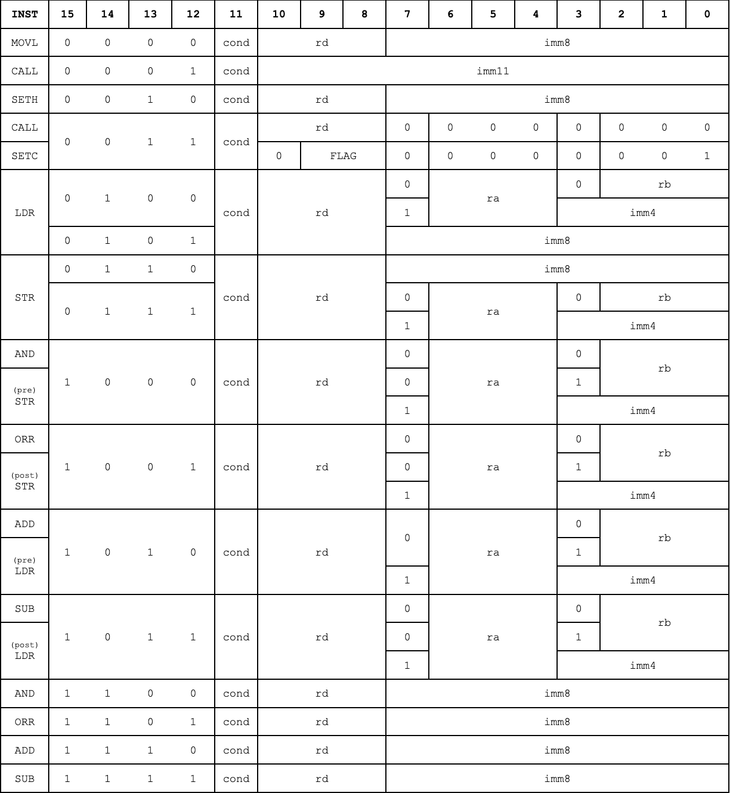

# Acknowledgement

This repository contains a *modified* version of my original submission for [Assignment 1](https://comp.anu.edu.au/courses/comp2300/assessments/assignment-1/) as a student at the Australian National University for the course [COMP2300 - Computer Architecture](https://programsandcourses.anu.edu.au/2025/course/COMP2300). Note that assignment-specific files are removed, and this repository contains only the necessary files to showcase my work. The `report.md` file specified in the assignment had also been merged into the `README.md`.

I declare that everything in this repository is entirely my own work, aside from the **Feedback and Marks** section of this file, which were provided by ANU. 

Note also this repository is a shallow clone of the original assignment repository, hence very few commits are shown. 

# Report 

This report describes my microarchitecture implementation  in [Digital](https://github.com/hneemann/Digital) and ISA design for the extended [QuAC](https://comp.anu.edu.au/courses/comp2300/resources/quac-assembler/). In this report, `bn` represents the n'th bit of instruction, e.g. `b14` is bit 14. 

## Overview

Three types of immediates are used.
+ `imm4`, 4-bit *signed* immediate number.
+ `imm8`, 8-bit *unsigned* immediate number.
+ `imm11`, 11-bit *unsigned* immediate number.

### ALU Immediates

Each ALU instruction accepts an `imm8`, operated onto `Rd`.

|Syntax|Description|
|:--|:--|
|`AND Rd, imm8` |`Rd := Rd & imm8`|
|`ORR Rd, imm8` |`Rd := Rd \| imm8`|
|`ADD Rd, imm8` |`Rd := Rd + imm8`|
|`SUB Rd, imm8` |`Rd := Rd - imm8`|

### Immediate Memory Addressing
Store/load from an `imm8` address, instead of that held in `Ra`. 
|Syntax|Description|
|:--|:--|
|`LDR Rd, [imm8]`|`Rd := mem[imm8]`|
|`STR Rd, [imm8]`|`mem[imm8] := Rd`|

### Base + Offset Addressing
Store/load from a base+offset address, offset is either an `imm4` (I-format) or `Rb` (R-format).

|Syntax|Description|
|:--|:--|
|`LDR Rd, [Ra, imm4]`|`Rd := mem[Ra + imm4]`|
|`STR Rd, [Ra, imm4]`|`mem[Ra + imm4] := Rd`|
|`LDR Rd, [Ra, Rb]`|`Rd := mem[Ra + Rb]`|
|`STR Rd, [Ra, Rb]`|`mem[Ra + Rb] := Rd`|


### Conditional Execution

An instruction `SETC` is defined with a 2-bit operand `FLAG`. `SETC` changes the flag to be detected for next conditional executions. 

|Syntax|Description|
|:--|:--|
|`SETC FLAG`|Changes conditional flag|

### Pre/Post Offset Addressing 
Stores/loads memory except the address register `Ra` is incremented by either `imm4` or `Rb` before or after the execution. 

|Syntax|Description|
|:--|:--|
|`LDR Rd, [Ra, Rb]!`|`Ra := Ra + Rb, Rd := mem[Ra]`|
|`STR Rd, [Ra, Rb]!`|`Ra := Ra + Rb, mem[Ra] := Rd`|
|`LDR Rd, [Ra, imm4]!`|`Ra := Ra + imm4, Rd := mem[Ra]`|
|`STR Rd, [Ra, imm4]!`|`Ra := Ra + imm4, mem[Ra] := Rd`|
|`LDR Rd, [Ra], Rb`|`Rd := mem[Ra], Ra := Ra + Rb`|
|`STR Rd, [Ra], Rb`|`mem[Ra] := Rd, Ra := Ra + Rb`|
|`LDR Rd, [Ra], imm4`|`Rd := mem[Ra], Ra := Ra + imm4`|
|`STR Rd, [Ra], imm4`|`mem[Ra] := Rd, Ra := Ra + imm4`|

Since `imm4` is signed, any immediate offsets may be negative.

### Function Calls and the Stack

A stack pointer `SP` is defined with register code `110`, which grows downwards from `0xFFFF`. `PUSH` and `POP` are defined for the stack.  `CALL` jumps the `PC` to `Rd` or `imm11` and pushes the old `PC`, and `RET` pops the stack into `PC`.
|Syntax|Description|Pseudo-instruction|
|:--|:--|:--|
|`PUSH Rd`|`SP := SP - 1, mem[SP] := Rd`|`STR Rd, [SP, -1]`|
|`POP Rd`|`Rd := mem[SP], SP := SP + 1`|`LDR Rd, [SP], 1`|
|`RET`|`PC := mem[SP], SP := SP + 1`|`POP pc`|
|`CALL Rd`|`SP := SP - 1, mem[SP] := PC, PC := Rd`|-|
|`CALL IMM11`|`SP := SP - 1, mem[SP] := PC, PC := imm11`|-|

`CALL` requires the execution of two instructions concurrently, it is not made a pseudo-instruction.

## ISA Changes

Below is my full instruction format.



- Four opcodes are defined for ALU immediate instructions. The 14th bit distinguishes between I-format and R-format. This choice ensures the wiring in the CU is clean. For example, The logic for any ALU immediate instruction is `b14 & b15`. 

- Two new opcodes are defined for I-format `LDR`/`STR`. This allows an (`imm8`) to be encoded. If instead the I-format is encoded into existing opcodes, only 16 possible addresses may be encoded, by an `imm4`, insufficient for most memory instructions. 

- For Base+Offset addressing, the least significant 3 bits for standard R-format `LDR`/`STR` encodes offset register `Rb`. This encoding remains backwards compatible, as the original 3 bits are 0, which by default sets offsets to `R0 = 0`. If `b7` is 1, then the instruction is in I-format and the least significant 4 bits encodes `imm4`.

- Pre/post-offset addressing encodes 8 instructions (pre/post, `LDR`/`STR`, I-format/R-format). Since there are insufficient opcodes to spare, `b3` and `b7` of ALU instructions are exploited to encode these instructions. Similar to Base+Offset addressing, bit 7 distinguishes between I-format and R-format.


- A single opcode can encode 16 instructions of no more than 7-bit operands (excluding `cond`). Opcode `0011` is chosen for these *short instructions*. `CALL` and `SETC` occupy 2 of the 16, but the ISA is extendable for more short instructions. 


- `0001` is dedicated for I-format `CALL`, allowing an `imm11` to be input, so immediate function calls works on larger programmes (<2048 lines). 


## Microarchitecture Changes

### Register File

I implemented a dual-ported register with its required inputs and outputs for pre/post addressing. The second port writes the offsetted address to `Ra`; the first writes to `Rd`. I implemented the *priority selector* to control overlapping write signals. Another read port is also added, since for R-format `STR` operations, three registers: `Rd`, `Ra` and `Rb` must be read simultaneously. I also added the stack pointer `SP` to the register file. 

### CU
I designed the CU with a 1-bit wire representing each type of instruction. For example, the line for `SUB` is `b15 & b13 & b12`. I also added many new control signals.

|Control Signal|Bits|Description|
|:---:|:--:|:---:|
|`RS3`|1|Read select 3|
|`WS2`|1|Write select 2|
|`WE2`|1|Write enable 2|
|`SETC`|1|Instruction is `SETC`|
|`IMM`|16|Immediate value converted to 16 bits, sign extended if necessary|
|`MEMIM`|1|Immediate memory operation is input|
|`PSTO`|1|Post-offset memory operation is input|
|`ALUIM`|1|The ALU should use immediate (`IMM`) input|
|`CALL`|1|`CALL` instruction is input|
|`CALLREG`|1|R-format `CALL` instruction is input|

Depending on the instruction, `IMM` is one of:
+ `IMM11 := INST && 7FF`
+ `IMM8 := INST && FF`
+ `IMM4`,  bits 0-3 signed extended to 16 bits. 

`7FF` and `FF` are bitmasks to vanish unnecessary non-immediate bits.

The Zero `Z` input is also generalised to `COND`.

The section below describes changes to the CPU. 
### Immediate ALU
If `ALUIM` is `1`, then
- the `B` input to the ALU will read `IMM`. 
- `RS1` is set to `Rd` in the CU, so the contents of `Rd` is read by ALU input `A`. 

### Immediate Memory Addressing
If `MEMIM` is `1`, then
- the address bus into the RAM (`1A`) is set to `IMM`.

### Base+Offset Addressing
- `RS3` interprets the least significant 3 bits as `Rb` and `OUT3` will go into ALU input `B`. 
- The ALU address bus will then be set to ALU `RESULT`, as opposed to a single register output like in the basic CPU. 
- The same control signals for [ALU immediates](#immediate-alu) allows I-format offsets, (`ALUIM` is defined as an OR between any immediate ALU instructions, I-format offsets, I-format pre/post offsets). 

### SETC
A new condition register is added in the CPU, which holds the current ALUFLAG used for conditional execution.
If the `SETC` signal is `1`, then
- `EN` is set to `1`,
- `FLAG` bits in the instruction is written into the register.
- `COND` is set to whether `FL` has the flag held in `COND` enabled.

### Pre/Post Offset

From [this](#prepost-offset-addressing), pre/post-offset requires concurrency between `ADD Ra, Rb/imm4` and memory access. Hence, the read select lines and ALU inputs are defined accordingly, with `ALUIM = 1` for I-format. Note that pre-offsets require setting `Rb` as the offset, since we need to simulate incrementing `Ra` by `Rb` *before* the actual memory operation. Selection of `Rb` as an offset is controlled by `PSTO`. 

### CALL
Executing `CALL Rd/imm11` is effectively executing `PUSH PC`, while moving the content of `Rd` or `imm11` to `PC` in the same clock cycle. Since `PUSH` is equivalent to a pre-offset `STR`, only the second write port is required for `PUSH`. As usual, the ALU is used to increment `SP`, and most wirings for pre/post-offsets can be reused for `CALL`. Hence, the first port is used to set `PC` is either `imm11` or contents of `Rd`. 

## Analysis and Tradeoffs

### Choice of Extensions

- **ALU immediates** are fundamental to the microarchitecture, as `ALUIM` and `IMM` lines abstracts the process of *selecting* immediate values, which simplifies circuitry for base+offset, pre/post and immediate memory addressing. 

- **Base+Offset addressing** was chosen for its usefulness: it simplifies the circuitry for pre-offset memory operations, since they require a concurrent execution of `LDR/STR Rd, [Ra, Rb]`. 

- **Pre/post-Offset addressing** significantly simplifies function calls, as function/stack instructions are either pseudo-instructions using pre/post-offset `LDR`/`STR`, or mostly utilises its circuits.

- **Immediate memory addressing** does not aid functions/callstack, but enables efficient and flexible code. I used 8-bit immediates, occupying two opcodes as a tradeoff, as using an `imm4` would limit access to only 16 addresses, which is practically insufficient.

- Similarly, **conditional execution** does not aid the HD extension, but allows sophisticated program execution. The `demo.quac` file exhibits a bubble sort algorithm, which requires inequality comparisons. Without `SETC`, such comparisons are infeasible. 

- Finally, **function calls** were chosen as they are fundamental in programming languages, while wider registers may be useful, they do not elevate the conceptual complexity of the ISA.

### ISA Tradeoffs

- ALU immediates exhibit a tradeoff in the ISA, since it occupies 4 extra opcodes. However, the [advantages](#choice-of-extensions) of ALU immediates significantly outweighs this tradeoff, as ALU immediates make program execution significantly more efficient. 

- The I-format `CALL` operation occupies an entire opcode, capable to encode an `imm11`, allowing immediate function calls to be used for large programs with thousands of instructions. 

### Microarchitecture Tradeoffs

- My CU compromises some efficiency for extensibility. Each opcode has a dedicated wire, making the design easier to extend and understand, analogous to how high-level languages sacrifice efficiency for abstraction. 

- `SETC` also sacrifices efficiency, as it requires an additional register in the CPU. However, the advantage is that conditional execution may be implemented without a fundamental restructuring of the QuAC ISA (expanding `cond` to 3 bits).
## Testing 

Several unit tests are provided in `unit_tests/`, which are converted to Digital test. My `demo.quac` is a bubble-sort on a 5-element array of 64-bit key-value pairs, with key-wise comparison; values are swapped *with* the key. After executing to the end (line 123), the demo successfully sorts the array.

### Before
|Array Index|Key|Value|
|:--|:--|:--|
|0|`0x0082`|`0x0001,0x0002,0x0003`|
|1|`0x0032`|`0x0004,0x0005,0x0006`|
|2|`0x0028`|`0x0007,0x0008,0x0009`|
|3|`0x00C9`|`0x000A,0x000B,0x000C`|
|4|`0x0003`|`0x0064,0x006E,0x0078`|

### After
|Array Index|Key|Value|
|:--|:--|:--|
|4|`0x0003`|`0x0064,0x006E,0x0078`|
|2|`0x0028`|`0x0007,0x0008,0x0009`|
|1|`0x0032`|`0x0004,0x0005,0x0006`|
|0|`0x0082`|`0x0001,0x0002,0x0003`|
|3|`0x00C9`|`0x000A,0x000B,0x000C`|

The array is 64-bits to demonstrate base+offset addressing, nested loops of bubble-sort use function calls, array iteration uses pre/post-offset addressing, and `SETC` is used for comparisons. Other extensions are demonstrated throughout the code. I also implemented other algorithms like `demo-factorial.quac` and `demo-fib.quac` in the root directory.

# Feedback and Marks

```
mark: 97

section_marks:
  part1: 20
  part2: 47
  report: 30
```

## Assignment 1 
This assignment is very well done and you have shown a very good understanding of CPUs and QuAC assembly programming.
Hopefully this assignment has taught you a lot about how real world computers execute programs 🙂.


### Basic CPU
All the tests pass.


### Extended CPU
Your extended CPU is very well thought out and well designed. The extensions build ontop of each other well showcasing some
clear thought in to how you have decided to design your extensions to build ontop of on one another. Your allocations of the instruction opcodes
is also well considered to simplify the logic for both your ALU operations and pre/post + base/offset addresing. The use of a condition register also effectively expands your instruction set and this is justified well in your report. Overall good style as well with extensive testing to verify your extensions are correct.

### Report
The report is very well formatted and covers all the relevant changes to the base ISA and microarchitecture. Good discussion of trade off and analysis in your report in relation to your CPU and real world programs.


